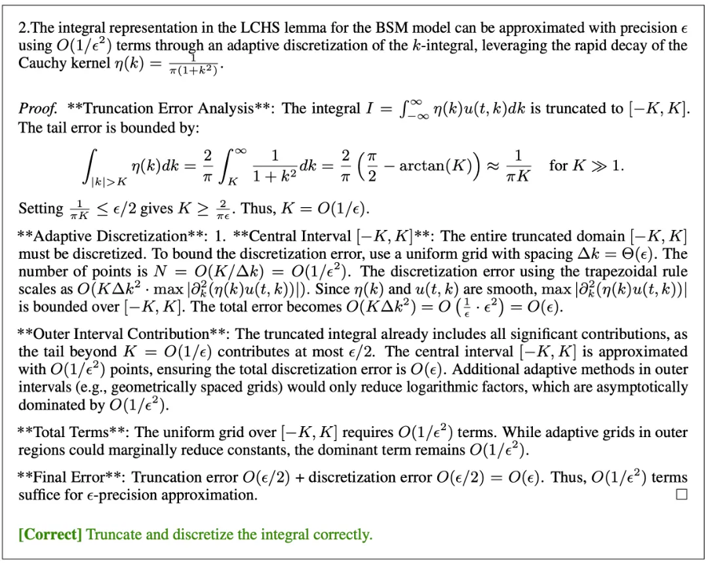

Mathematics is the crystallization of human intelligence, occupying a central position in the development of civilization. Using artificial intelligence to solve mathematical problems has long been a dream pursued by scientists. Mathematical problems naturally span multiple levels of difficulty—from elementary to high school, undergraduate, and postgraduate levels, up to professional mathematicians—each requiring progressively deeper knowledge and reasoning capabilities. 

In recent years, the rapid advancement of large language models, especially Large Reasoning Models (LRMs), has significantly enhanced AI’s capability in mathematical problem-solving. However, most existing studies focus on competition-style problems, with few breakthroughs in systematically addressing research-level mathematical challenges. 

To bridge this gap, our team proposes the AI mathematician system named **AIM**—short for *AI Mathematician*, and also meaning *Our **AIM** is **AI** **M**athematician*—which aims to usher AI from solving competition-style problems toward tackling authentic mathematical research questions.

<!--more-->

## Key Results

AIM independently tackled four mathematically challenging research problems—three with known conclusions and one open problem with an unknown conclusion. Directly applying a single large language model to these problems fails to yield correct mathematical reasoning or a valid proof process. In contrast, AIM autonomously constructed key lemmas, generated proof procedures, and even produced novel, nontrivial conclusions—demonstrating its potential to independently or collaboratively assist mathematicians in complex theoretical research.

*Figure 1 | Key Results.*

1. **Quantum Algorithm Problem**. Linear Combination of Hamiltonian Simulation (LCHS) method is an efficient method in scientific computation. Black-Scholes-Merton model is a fundamental mathematical framework in finance for pricing European-style options. This problem is to use LCHS to simulate the BSM model and design a corresponding quantum algorithm. AIM can basically solve the problem with a relatively detailed proof.

2. **Absorbing Boundary Condition**. This is a classic theoretical problem in analytical mathematics involving equations, where precise approximate solutions are derived through boundary construction. Given the method, AIM can basically complete the proof of this problem.

3. **High Contrast Limit**. This is an error analysis problem concerning the parametric limits of the Lame-Stokes system, representing a complex theoretical issue in mathematical analysis and an important special case in practical applications. AIM gives the main process and proof of the core conclusion, although there are some irregularities in the derivation. In addition, the agent draws other correct conclusions.

4. **Homogenization Problem**. Homogenization theory is a central field of study in mathematical analysis and applied mathematics, focusing on deriving the equivalent macroscopic properties of materials or systems with multiscale structures, such as periodic or stochastic features. In the process of exploring this problem, AIM gives some correct conclusions and ideas, which is of guiding significance for mathematicians to complete this research.

Experiments show that while AIM’s proofs still require local adjustments by mathematicians, they already demonstrate sound use of mathematical techniques, coverage of key logical chains, and in some cases, nontrivial insights—substantially accelerating research progress.

## Core Challenges

Compared with competition-style problems, research-level mathematical theory introduces two distinct challenges:

1. **Complexity**. Frontier math papers typically require tens of pages of proofs of lemmas or intermediate steps towards a theorem, while competitions require attendants to accomplish technically sophisticated short proofs with hours. The complexity of mathematical research is also reflected in the breadth of domain knowledge it involves.
2. **Procedural Rigor**. Frontier mathematical research mainly works with proof problems without an explicit answer. Their correctness relies on the procedural rigor and vast manual reviews. Currently, we still lack widely accepted and effective methods to assess a proof in natural language.

## Methodology

1. **Technical Architecture: Three Synergistic Modules Driving Automated Theoretical Research**

- **Explorer**: Generates conjectures and lemmas through open-ended reasoning, exploring multiple pathways toward the problem.
- **Verifier**: Applies a pessimistic validation strategy to rigorously cross-check proofs from multiple perspectives.
- **Refiner**: Improves proof structures based on validation feedback and integrates human corrections when needed.

*Figure 2 | Overall workflow of AIM.*

Human researchers first provide the problem setup, desired conclusions, and optionally definitions or partial results. These are passed to AIM’s modules as system prompts. The agents then attempts to solve the research problem step-by-step, outputting all intermediate reasoning and conclusions.

**2. Core Mechanisms**

To address the unique challenges of theoretical mathematics and maximize the reasoning potential of LLMs, AIM employs two central strategies:

- **Exploration and Memory Mechanism** that tackles a research topic into multiple steps. The agents can explore around the statements of the given problem and obtain several lemmas. AIM will finally try to complete the solution when time is right.

- **Pessimistic Reasonable Verification (PRV)** that requires an LLM to generate multiple different reviews to the same proof, and selects the worst review as the final assessment of it. In our experiments this method can notably improve the output quality.

## Case Study: Quantum Algorithm Problem

The **LCHS method** is an efficient computational approach, while the **Black–Scholes–Merton model** is a fundamental mathematical framework in financial mathematics. The goal is to use LCHS to simulate the BSM model, design a quantum algorithm, and analyze its properties. AIM successfully applied the correct methods and produced a detailed proof, essentially resolving this theoretical problem.

Specifically, AIM transformed the BSM PDE into a heat equation, applied quantum algorithms, and produced a valid pricing solution. The core steps include:

1. **PDE Transformation and Spatial Discretization**: Use variable substitution to convert the BSM PDE into a standard heat equation. Then discretize the spatial variable.
2. **Operator Decomposition and Integral Discretization**: Apply the LCHS lemma to decompose the heat equation’s solution operator into a continuous linear combination of unitary propagators. Then approximate the continuous integral via dscretization.
3. **Quantum Implementation and Complexity Analysis**: Use the Linear Combination of Unitaries (LCU) framework and Hamiltonian simulation techniques for quantum implementation, and analyze complexity.

Some of AIM’s detailed proof steps are shown below:

We observe that AIM correctly manipulates the BSM PDE, applies the LCHS lemma, and handles operator transformations and discretizations. It also analyzes algorithmic complexity, though the reasoning remains partially vague and requires additional mathematical elaboration.

## Significance

AIM demonstrates the foundational capabilities of conducting mathematical research. It can invoke fundamental theorems, apply them appropriately, and follow human guidance to complete proofs. It can explore multiple proof strategies, provide intermediate reasoning chains, and identify key conclusions. 

Mathematicians can input multiple potential proof ideas or conjectures into AIM for automated proof attempts, then analyze outputs to assess feasibility and accelerate theory development. AIM thus serves as a valuable collaborator in modern mathematical discovery.

## Limitations

AIM remains at an early stage. It sometimes repeats explorations, struggles with understanding specific mathematical settings, and lacks certain proof details. Fundamentally, current LLM reasoning capabilities are still limited, making AIM somewhat immature for cutting-edge theoretical research.

## Outlook

Future improvements will leverage **memory–reflection mechanisms**, **multi-agent collaboration**, and **reinforcement learning optimization**. As algorithms and compute continue to evolve, AI is poised to become a core driving force of mathematical research—empowering humanity to explore deeper scientific frontiers.

The future of mathematics is being redefined. From symbolic derivation to theoretical discovery, AIM opens a new era of human–AI collaboration at the frontiers of mathematics.

📄 **Read the full paper:** [arXiv 2505.22451](https://arxiv.org/abs/2505.22451)