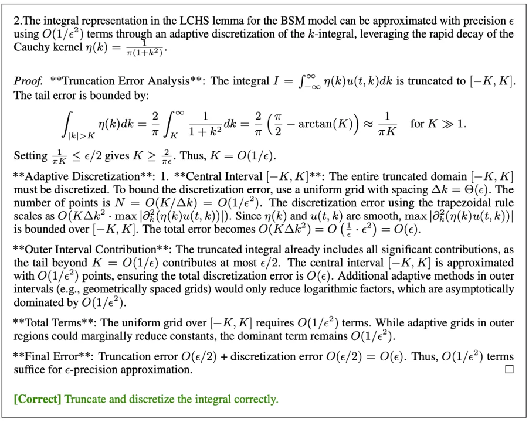
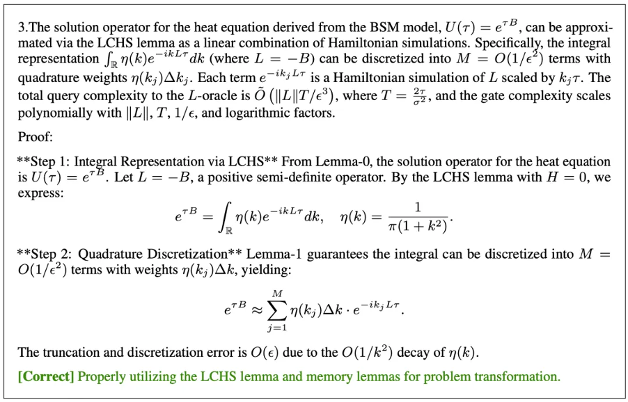
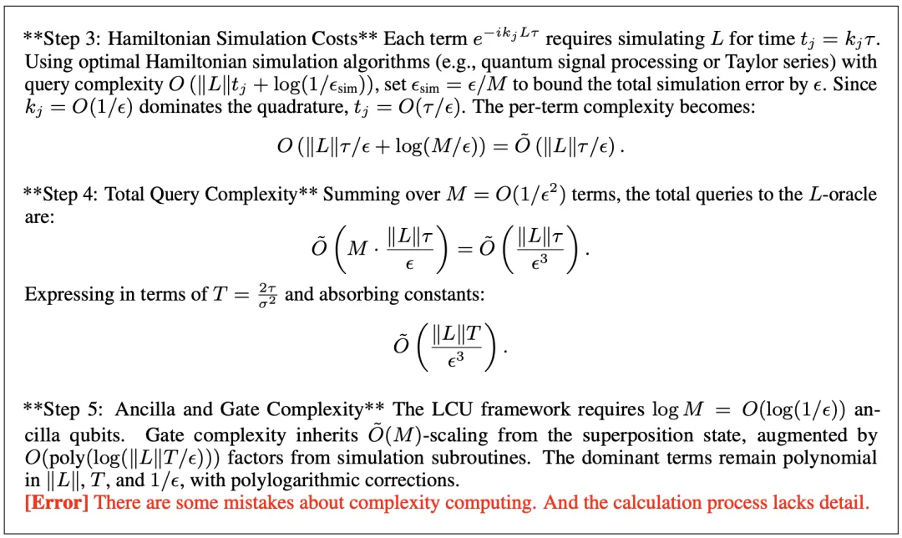

数学是人类智慧的结晶，在文明发展中始终居于核心地位。借助人工智能解决数学问题，一直是科学家孜孜以求的目标。数学问题天然分为多层次难度：从小学生、初高中生到大学生、研究生，再到专业数学家，所需的知识体系与推理能力逐级递进、各有侧重。近年来，大模型，尤其是大推理模型（Large Reasoning Models, LRMs）的飞速发展，大幅提升了AI在数学求解上的能力。然而，现有研究主要聚焦于计算类与竞赛类题目，在系统性解决研究级数学问题方面仍鲜有突破。基于此，研究团队提出AI数学家系统AIM（AI Mathematician，并寓意“Our **AIM** is **AI** **M**athematician”），旨在引领AI从解决计算与竞赛题目迈向处理真实数学研究问题的新时代。

<!--more-->

## 关键结果
AIM尝试独立求解了四个数学上具有挑战性的研究问题，其中三个是结论已知的数学问题、一个是结论未知的开放数学问题。将单个大模型直接应用于这些问题难于得到正确的数学推理结果，并且不能构成数学理论中的有效证明过程。而AIM在其中自主构造关键引理，给出证明过程或者提供不平凡的新结论，呈现出独立或辅助数学家完成复杂数学理论研究的重大潜力。

*图 1 | 关键结果。*

1. **量子算法问题**。LCHS方法是科学计算中的一种高效计算方法。Black-Scholes-Merton模型是金融学中用于欧式期权定价的基本数学框架。这个问题就是利用LCHS来模拟BSM模型，并设计相应的量子算法。实验表明，AIM可以给出比较详细的证明，基本解决这个问题。

2. **吸收边界条件**。这是分析中涉及方程的经典理论问题，通过构造人工边界得到较为精确的近似解。给出合理的思路后，AIM可以正确运用提到的方法与技术。最后给出了一个完成度很高的证明。

3. **高对比度极限**。这是一个关于Lame-Stokes系统参数极限的误差分析问题，是方程分析理论中的一个复杂问题，也是实际应用中的一个重要特例。虽然推导中存在一些不严谨之处，但是AIM给出了核心结论的主要证明过程和推导细节，并且还探索出了一些新的正确的结论。

4. **均匀化问题**。均匀化理论是方程分析和应用数学的一个重要研究领域，专注于推导具有多尺度结构的材料或系统的等效宏观性质，如周期性或随机特征。在探索这一问题的过程中，AIM给出了一些正确的结论和思路，对数学家完成这一研究具有指导意义。

实验表明，AIM生成的证明虽仍需数学工作者进行局部调整，但已能合理运用数学技术，覆盖核心逻辑链，甚至在部分问题中洞察非平凡结论，显著加速研究进展。

## 核心挑战

相较于计算类与竞赛类数学问题，数学理论的研究主要有以下两大独特挑战：

1. **问题复杂度**：数学理论的推导和证明往往需要复杂的思考过程和推导细节，需要引理证明和跨领域的知识整合。这样的复杂度远超竞赛题的求解模式。

2. **证明严谨性**：数学研究的证明内容需要经过严格验证和精确的分析，而自然语言证明的评估一直缺乏有效方法。基于此，AIM框架首次将大模型的推理能力引导延伸至前沿数学研究，在人工智能探索数学理论的道路上迈出了重要一步。

## 主要方法

1. **技术架构：三大模块协作驱动自动理论研究**

- **探索模块**：通过开放推理，生成猜想和引理，构建问题的多种探索思路；

- **验证模块**：基于悲观验证机制，对证明过程进行多角度并行评估，确保证明严谨性准确性；

- **修正模块**：根据验证反馈优化证明结构，并且可以接收人为修正意见，确保输出结论的正确性。

*图 2｜AIM 总体工作流程示意。*

人类工作者首先提供探究课题的一些问题设定和求解结论，也可以包含方法信息，例如术语的定义，或者一些初步结论。这些内容将视为系统提示传递给三个模块。在这之后，会将数学研究需要求解的问题传递给这个智能体。AIM将尝试一步一步地解决这个问题，并输出其所有中间过程和结论。

**2. 核心机制**

为了应对数学理论的挑战，更好的激发LRMs在数学研究的推理能力，提高证明的完成度，AIM通过以下两大核心策略攻克难题：

- **“探索+记忆”机制**：智能体围绕研究命题自由探索可行的方向。通过验证，逐步生成中间猜想完成理论的推导证明。如此可以有效拆解过长思维路径，通过多轮递进自动形成研究思路。

- **“检验与修正”机制**：检验模块中，有多重 LRM 并行评审证明过程，取最严苛意见拒绝不严谨证明。再将评估意见迭代反馈给修正模块，自动修正完善每一处证明细节。

在这样的迭代反馈机制下，AIM会仔细思考每一种证明思路，完善中间结论的证明，最后给出整个问题的逐步证明过程

## 实例分析：量子算法问题

Linear Combination of Hamiltonian Simulation（LCHS）方法是科学计算中的一种高效方法，Black-Scholes-Merton（BSM）模型则是金融领域用于定价欧式期权的基础数学框架，二者的碰撞能否产生别样的火花呢？为了回答这一问题，我们希望利用LCHS方法对BSM模型进行模拟，设计相应的量子算法，并分析算法的具体性质。实验显示AIM正确运用了这一方法，提供了较为详细的证明过程，基本解决这一数学理论问题。

具体的，AIM通过将BSM模型的偏微分方程转化为热方程并利用给出的量子算法，基本解决了BSM模型的定价问题，核心步骤如下：

1. 偏微分方程转换与空间离散化：通过变量替换将BSM偏微分方程转换为标准热方程，并对空间变量进行离散化处理；

2. 算子分解与积分离散化：应用哈密顿量模拟的线性组合（LCHS）引理，将热方程的解算子分解为酉传播算子的连续线性组合，随后通过离散化对连续积分进行近似处理；

3. 量子实现与复杂性分析：利用酉算子线性组合（LCU）框架和哈密顿量模拟技术完成量子算法实现，并分析计算复杂性。

AIM给出的具体证明过程如下：

可以看到，AIM正确处理了BSM偏微分方程，再结合给出的LCHS引理，进一步将方程变换和积分离散化，最后分析了算法的复杂度性质。但同时也需看到AIM还远非完美，它对复杂性的计算过程较为模糊，需要进一步补充数学推导细节并修正局部错误。

## 重要价值

AIM在数学研究中展现了基本的数学研究能力。它可以在证明过程中调用基本定理，并应用这些定理完成证明过程。它还展示了识别和实现人工提供的指导和提示的能力，最终按照指示完成证明过程。

AIM可以尝试完成各种数学理论的证明。它可以运用正确的证明思路，提供关键的中间过程和核心结论。在数学理论研究中，数学家们经常会产生多个证明思路和猜想。这些潜在的方法可以系统地输入到AIM中，用于自动生成证明尝试。然后，数学家可以分析输出结果，以确定方法的可行性，从而推进理论证明。后续也可以进一步根据实验结果，尝试更多的方法和思路，继续使用AIM来探索数学理论的证明与结论。

## 局限性

目前的AIM数学家智能体仍处于非常早期的阶段。目前出现的问题包括重复探索，对特定的数学设定理解能力不够强以及缺乏部分证明细节等问题。当然最核心的是当前的LLM的推理能力还并不够强大，因此在很多较为前沿的复杂数学理论的研究中还是略显稚嫩。

## 展望未来

未来将通过记忆反思机制、多智能体协作和强化学习优化等途径进一步提升能力。随着算法与算力的迭代，人工智能有望成为数学研究的核心驱动力，推动人类向更深远的科学未知发起挑战。

数学的未来，正在被重新定义。从符号推导到理论发现，AIM 开启了人工智能与人类智慧共探数学边疆的新纪元。欢迎关注后续研究，见证 AI与科学的深度融合！

📄 **阅读原论文：** [arXiv 2505.22451](https://arxiv.org/abs/2505.22451)

