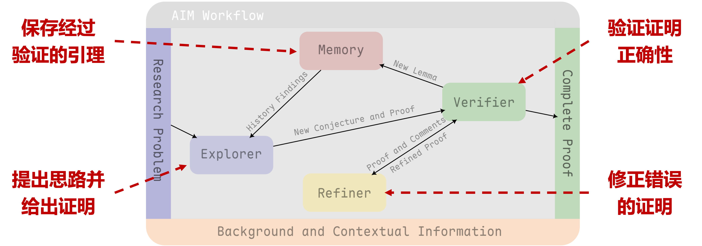
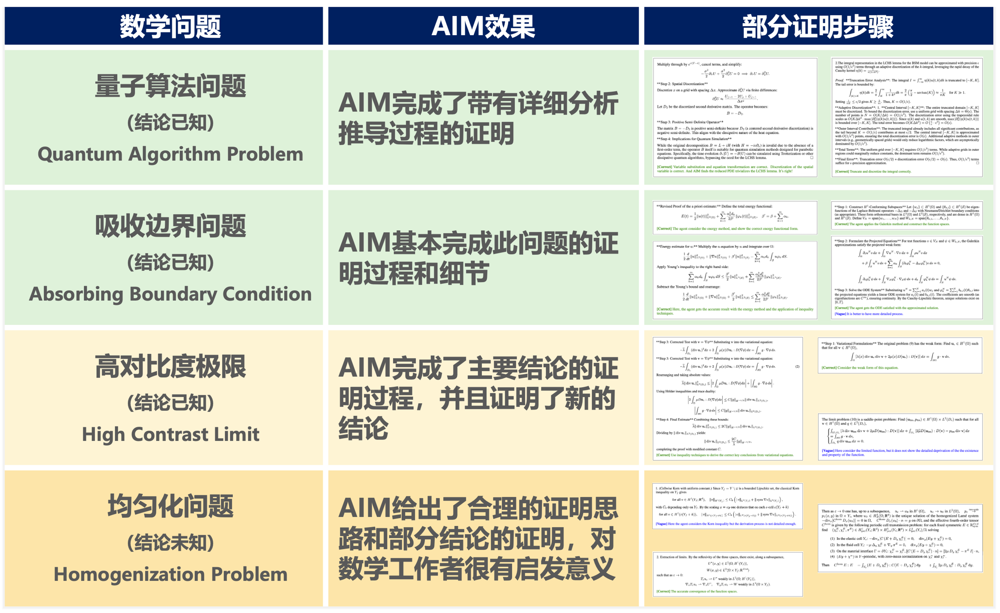

**AI Mathematician（AIM）** 是我们迈向“全自动化前沿数学研究”的第一步。  
它探索了大规模推理模型如何超越竞赛级解题，真正参与数学发现——通过探索、记忆与验证机制，实现长程且严谨的推理。

<!--more-->

## 🧠 AIM 是什么？

AIM 是一个**基于大语言模型（LLM）的多智能体框架**，旨在尽量减少人工干预地开展数学研究。  
系统包含三个核心智能体，并通过两个相互交织的循环协作：

- **探索者（Explorer）**：提出猜想并撰写详细证明；  
- **验证者（Verifier）**：以“悲观”标准严格审查每一步；  
- **改进者（Refiner）**：根据验证反馈修正推理。

三者协同形成：
- **探索循环**：支持长链式推理；  
- **改进循环**：确保过程严谨、结果可靠。

*图 1｜AIM 总体工作流程示意。*

## ⚙️ 核心技术

### 1）探索与记忆机制
面对新问题，**探索者**不会直接求解，而是先生成多个猜想、测试部分思路，并将有潜力的引理存入**记忆模块**。经验证的引理随后被重用，以指导更深入的推理过程。

### 2）悲观理性验证（PRV）
验证环节极具挑战。为模拟严格的同行评审，**验证者**进行多轮独立审查，并以“最悲观”结果为最终裁决——只要有一次审查认为不正确，该证明即被否定。这一保守策略显著提升了可靠性，符合学术界的严谨标准。

## 🧩 前沿问题实验

我们在**四个科研级数学课题**上评估了 AIM：

*图 2 | 结果总结。*

在所有课题中，AIM 均能自主构建大量证明内容，并提出**非平凡的中间结果**；多位教授审阅后认为，其中不少结果在数学上具有价值，可直接服务于后续研究。

## 📈 我们的经验

- **探索很关键：** 迭代式引理构建显著提升长链推理能力。  
- **验证更关键：** PRV 有效抑制模型过度自信与潜在错误。  
- **人机协同显现：** 多个课题中，AIM 的部分证明直接启发了新的人工发现。

## 💬 反思

我们认为 AIM 并非终点，而是一个**概念验证**：证明大型推理模型已经能够参与开放性的数学研究。借助探索、记忆与验证的合理结构，模型可以从“解题”迈向真正的“科研”。

## 🔮 未来方向

1. **形式化验证：** 与 Lean、Coq 等证明助手结合，实现机器校验；  
2. **自主发现：** 从解决既有问题迈向生成新猜想；  
3. **多模态推理：** 结合图形、视觉直觉与符号操作；  
4. **多智能体协作：** 让多个 AIM 互相批评与改进。

我们相信，这些方向将加速从“AI 解数学”到“AI 创数学”的跨越。

## 🌟 结语

**AI Mathematician** 代表了通往全自动数学研究梦想的一个切实起点。尽管当前许多证明仍不完整，人类洞见依然不可或缺，但每一次迭代都让我们更接近那个时代——**AI 与人类数学家并肩拓展知识前沿的时代。**

---

📄 阅读原论文： [arXiv 2505.22451](https://arxiv.org/abs/2505.22451)

