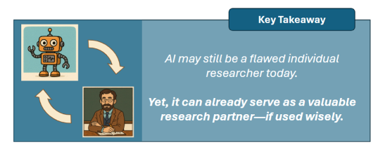
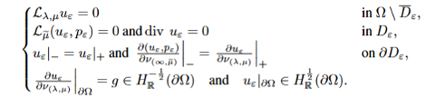
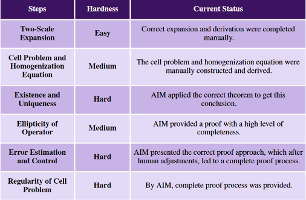
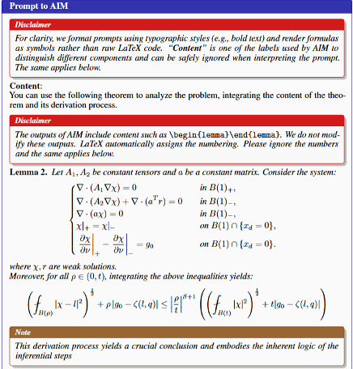
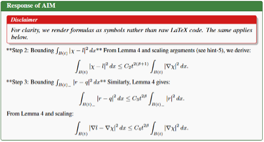

Using the self-developed **AI Mathematician system (AIM)** as a research collaborator, we successfully solved a challenging problem in homogenization theory through a human–AI collaborative paradigm, resulting in a **17-page mathematical proof**. This work systematically verifies the feasibility of upgrading AI from a mere *mathematical problem-solving tool* to a true *research partner*, opening a new path for breakthroughs in complex mathematical problems.

<!--more-->

## I. The “AI Dilemma” in Mathematical Research: From Competition Breakthroughs to Research Bottlenecks

In recent years, AI has repeatedly demonstrated impressive achievements in mathematics. Gemini reached gold-medal-level performance in IMO 2025 via Deep Think technology; the o4-mini model surpassed human average teams in the FrontierMath expert-level benchmark; and GPT-5-Thinking assisted researchers in solving quantum computing challenges. However, these successes mostly center on *short, standardized tasks* like competitions, far from the demands of real mathematical research.  

Current mainstream AI systems face clear limitations: FunSearch and AlphaEvolve rely on problem formalization and apply only to specific areas; the AlphaGeometry series focuses on geometric reasoning, leaving other mathematical branches untouched. Even when AI provides fragmented insights, constructing and verifying complete proofs still depend on humans—preventing genuine integration into the research workflow.  

**The core goal of this study** is to overcome this barrier by building a human-AI collaborative paradigm, enabling AI’s reasoning capabilities to complement human logical analysis and domain expertise, thereby tackling complex problems that neither could solve alone.

## II. Key Result: A 17-Page Mathematical Proof Far Beyond Existing Work

Homogenization theory bridges materials science, fluid mechanics, and mathematics, focusing on how microscopic heterogeneity affects macroscopic mechanical behavior. This study investigates **how to rigorously derive and prove the homogenized limit of a coupled Stokes–Lamé system as the inclusion scale ε → 0**, along with precise **error estimates between the original and limit solutions**.  

**Originating from a real mathematical research question**, the problem is notably challenging. Ultimately, through human–AI collaboration, we not only derived the limit equations but also **proved the error order α = 1/2**, forming a **complete 17-page proof**.

*Figure 1: Stokes–Lamé System*

Specifically, through iterative human–AI analysis, the problem was decomposed into six subproblems (see Figure 2). Each subproblem was systematically addressed via collaboration, culminating in a complete proof of the original problem. **The AIM system made non-trivial contributions to several of the most challenging subproblems.**

*Figure 2: Subproblem Decomposition and Human–AI Division of Labor*

## III. Core Methodology: Five Collaborative Interaction Modes as a Practical Guide for AI-Assisted Mathematics

Rather than simply *using* AI, we distilled five effective modes of human–AI interaction—providing a reusable and generalizable framework for mathematicians working with AI:

1. **Direct Prompting:** Guiding AIM via *theorem prompts*, *conceptual guidance*, and *detail refinement* to focus on key reasoning paths and reduce exploration noise. For instance, in the analysis of the “Cell Problem”, human experts supplied auxiliary lemmas grounded in established theory, anchoring AIM’s reasoning to rigorous foundations.
2. **Theory-Coordinated Application:** Supplying AIM with “knowledge package” (definitions, lemmas, rules) from a specific mathematical theory to enable multi-step, consistent reasoning. In proving regularity of the Cell Problem, experts provided the full *Schauder Theory* lemma set, enabling AIM to derive the correct conclusion coherently.
3. **Interactive Iterative Refinement:** Following a cyclic “AI output → human diagnosis → feedback correction → AI re-derivation” loop to refine proofs. During error estimation, when AIM’s reasoning had gaps, experts subdivided intermediate problems, guiding AIM to self-correct and complete the reasoning chain.
4. **Applicability Boundary and Exclusion Domain:** Assigning tasks that AIM struggles with—such as complex geometric constructions or multi-scale symbolic differentiation—to humans, preventing wasted effort. For example, in *two-scale expansions*, human experts handled derivative decomposition manually to ensure symbolic correctness before AI resumed downstream reasoning.
5. **Auxiliary Optimization Strategies:** Using multiple trials to select the optimal proof (leveraging LLM stochasticity), constraining reasoning direction via expected results, and selecting the best-suited models (e.g., o4-mini for framework construction, DeepSeek-R1 for fine-grained derivation) to maximize reliability and efficiency.

## IV. Representative Case

In the proof of the *Regularity of the Cell Problem*, human experts provided AIM with auxiliary lemmas from **Schauder Theory** (Figure 3). These lemmas guided AIM’s reasoning process, helping it construct valid and complete argumentation.

*Figure 3: Human Experts Provide Schauder Theory Lemmas to AIM*

Under this guidance, AIM’s output (Figure 4) demonstrated that it could appropriately integrate the given information and execute the correct reasoning process.

*Figure 4: AIM Output*

## V. Significance

This work goes beyond solving a single problem—it establishes new paradigms, validations, and methodological insights for integrating AI into mathematical research.

- **Value 1: Validating the Human–AI Collaborative Paradigm**  
  We validated a *“human-guided + AI-reasoned”* research model that merges AI’s deductive power with human expertise and logical rigor. This paradigm extends mathematicians’ capabilities and enhances AI’s ability to contribute to theoretical research.
- **Value 2: Solving a Challenging Homogenization Problem**  
  We delivered a full 17-page proof, with a substantial portion generated by AI. AIM made non-trivial contributions throughout, highlighting the paradigm’s potential to solve complex, research-level mathematical problems.
- **Value 3: Systematizing Interaction Modes**  
  We systematically analyzed and distilled empirically grounded human–AI interaction patterns. These findings offer valuable reference points for future AI-assisted mathematical research frameworks and practical guidance for mathematicians aiming to integrate AI into their workflows.

## VI. Outlook

AI’s comparative advantage in mathematical research lies in *analyzing, searching, and adapting* within existing theoretical frameworks—e.g., decomposing problems, surveying literature, and optimizing known methods. In contrast, core mathematical breakthroughs—such as introducing new concepts, constructing new frameworks, or designing novel proof paradigms—still rely on **human intuition and abstraction**, given AI’s tendencies toward *hallucination* and *overconfidence in errors*.  

Based on current findings, we identifies two key directions for future research:

- **Deepening and Systematizing Human–AI Interaction:**  
  We has identified a set of interaction modes that accelerate theoretical progress and extend human research capabilities. The next step is to test their transferability across domains and to build more diverse, efficient frameworks tailored to specific fields. We plan to systematically structure interaction mechanisms around decomposition, supervision, error correction, theorem referencing, and dependency management—requiring rigorous experimental classification and effect quantification.
- **Improving AIM via Feedback-Driven Optimization:**  
  Our long-term goal is automated theorem proving. Through collaborative proof experiments, we have mapped the strengths and weaknesses of AI agents across task types. These insights will guide future architectural iterations and training strategies to enhance reasoning performance, thus advancing LLM capabilities in theoretical mathematics.

📄 **Read the full paper:** [arXiv 2510.26380](https://arxiv.org/abs/2510.26380)
