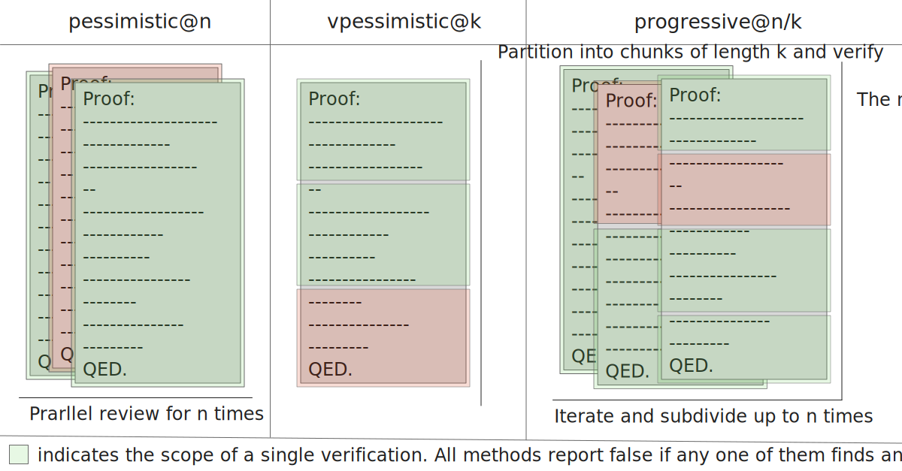
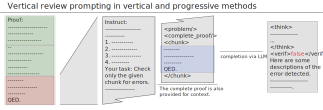
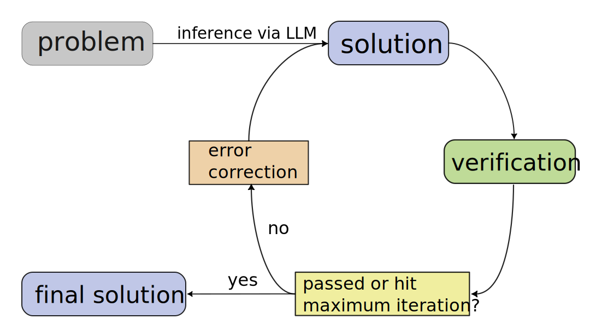

在数学智能体中，“会做题”还不够，“会检查证明”同样关键。无论是让模型反复改进自己的解答，还是在强化学习中给开放式证明提供反馈，自动验证都决定了系统能否长期可靠地工作。

我们的 ICML 2026 论文 **Pessimistic Verification for Open-Ended Math Questions** 研究了一个简单但有效的思路：验证数学证明时，与其让多个评审投票，不如把任务明确改成“找错”。只要任意一个评审发现了关键错误，这份证明就应当被拒绝。

<!--more-->

## 为什么需要悲观一点

开放式数学题通常没有一个可以直接比对的最终答案。证明可能整体方向正确，却在某个引理、变形或边界条件上出现细小漏洞。对大模型来说，验证的难点往往不是“认可正确证明”，而是“发现错误证明中的错误”。

这也解释了为什么多数投票在证明验证中并不理想：如果错误本身很隐蔽，多数评审可能都没有发现它，投票反而会掩盖少数有价值的负面判断。悲观验证采用相反原则：把每一次有效的错误发现都当作强信号。

## 三种验证方式

*图 1 | 本文比较的三种悲观验证方式。*

我们实现并比较了三种形式：

1. **Simple Pessimistic Verification**：对整份证明并行检查多次，只要任一次发现错误就拒绝。
2. **Vertical Pessimistic Verification**：把证明切成若干片段，让模型深入检查每个局部细节。
3. **Progressive Pessimistic Verification**：先检查整份证明，过滤明显错误；再逐步细分剩余证明，集中预算检查更细的步骤。

其中 progressive 方法表现最好。它避免了对每个证明都一上来做高精度局部检查，也避免了只粗略重复看整篇证明带来的浪费。

*图 2 | 分段检查让模型聚焦于证明中的局部推理。*

## 实验结果

我们在 IMO-GradingBench、Hard2Verify 和 QiuZhen-Bench 上进行了验证实验，并使用 TPR、TNR 和 Balanced F1 衡量模型判断正确证明与错误证明的能力。结果显示，progressive 悲观验证可以稳定提升模型发现错误的能力，并在大多数模型上提高 Balanced F1。

一个重要观察是：强模型在悲观验证下产生的一些“误拒绝”并不一定是真错。人工复查发现，GPT-5-mini、GPT-5 和 Gemini 3 Pro Preview 的不少 false negative 实际上指出了原数据标注中遗漏的关键错误。这说明现有验证基准在前沿模型上可能已经低估了真实能力。

在效率上，progressive 方法也更划算。以论文中的辅助测量为例，在 GPT-5-mini 上，`prog@3/6` 达到 0.85 Balanced F1，平均约 7.1K 等价输出 token；而简单并行的 `pes@12` 达到 0.87 Balanced F1，却需要约 35.7K 等价输出 token。也就是说，在接近的性能区间内，progressive 方法只需约四分之一的 token、时间和 API 成本。

## 对解题工作流的影响

悲观验证不仅是一个静态评测方法，也能放进自动解题系统中。我们构建了一个简单的“生成答案-验证-根据反馈修正”的迭代流程，并在 IMO 2025 和 MathArena Apex 2025 上测试。

*图 3 | 验证辅助的迭代解题流程。*

在 IMO 2025 上，Gemini 3 Pro Preview 直接作答总分为 13 分；加入简单悲观验证后提升到 17 分；使用 progressive 悲观验证后提升到 22 分，同时 token 使用低于简单并行验证。在更难的 MathArena Apex 2025 上，progressive 验证也展现出更好的性能和效率曲线。

## 我们学到的事

这项工作背后的核心观点很朴素：对数学证明而言，可靠性来自对错误的敏感性。一个好的验证器不一定要“更会打分”，但必须更会发现关键漏洞。

悲观验证并不提供形式化证明那样的绝对保证，但它为自然语言数学证明提供了一种实用、低成本、可扩展的检查机制。随着大模型推理能力继续提升，这类验证方法可能会成为数学智能体、AI 辅助研究和开放式数学强化学习中的基础模块。

📄 **阅读论文 PDF：** [Pessimistic Verification for Open-Ended Math Questions](pessimistic-verification.pdf)

💻 **代码仓库：** [THUNLP-MT/pverify](https://github.com/THUNLP-MT/pverify)
