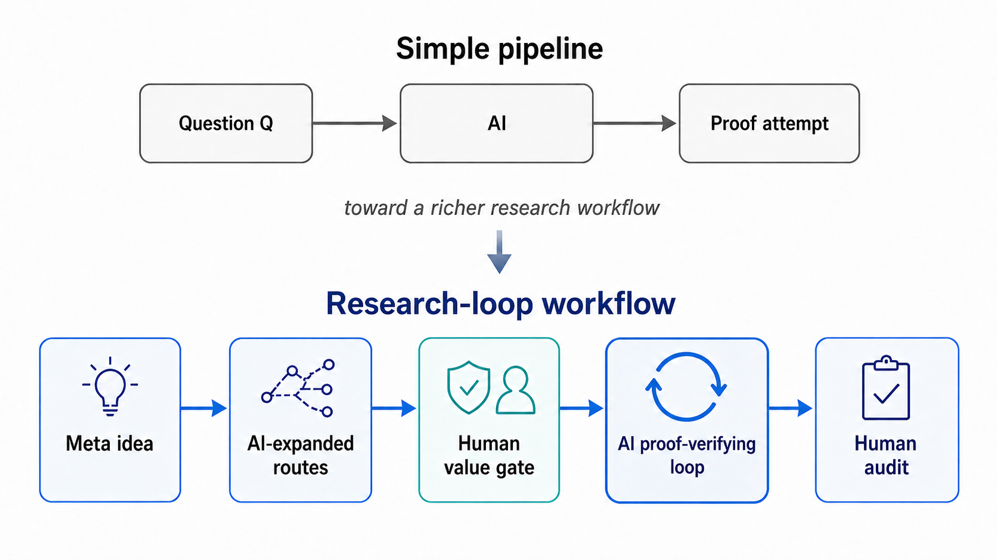
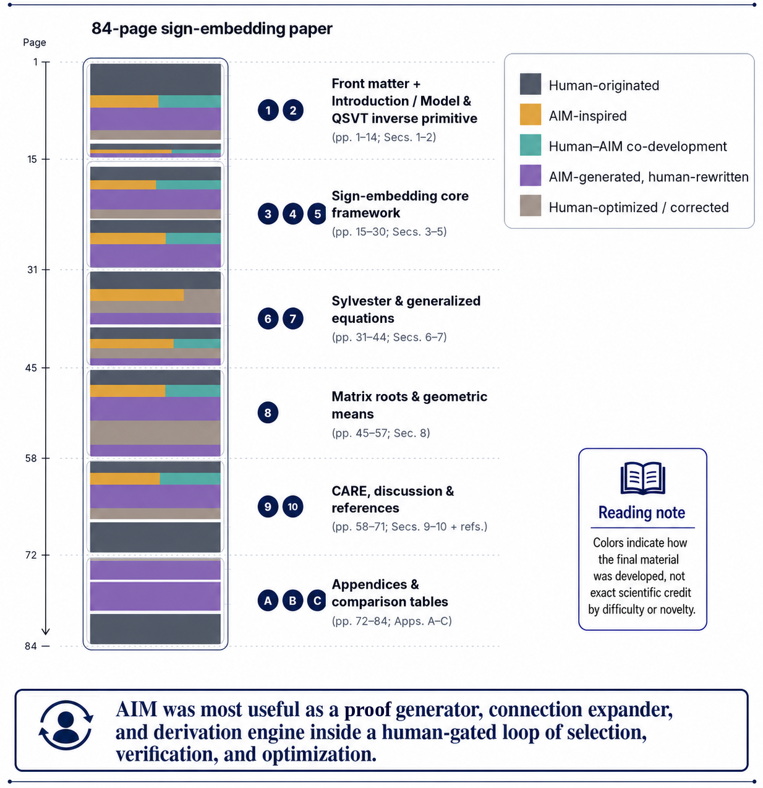
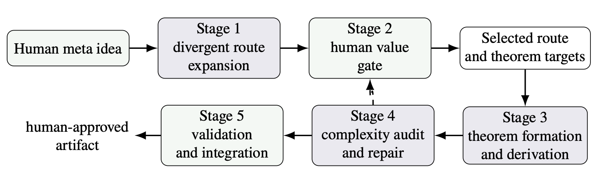

我们近期将 AI 数学家系统 AIM 应用于一项前沿数学与量子算法研究，并提出了面向矩阵方程和矩阵函数问题的“符号嵌入量子算法”（Sign-Embedding Quantum Algorithms）。在这一成果形成过程中，我们结合通用 AI 交互探索与 AIM 系统，在研究路线拓展、问题形成、候选定理与证明生成、复杂度分析和结果完善等环节开展人机协同，使 AI 与 AIM 在从“问题形成”到“问题求解”的研究闭环中发挥了非平凡作用。

<!--more-->

## 一、研究背景：AI 数学能力正在从“解题”走向“研究”

近年来，AI 在数学推理、算法搜索、猜想检验和证明辅助等方向持续取得进展。许多已有案例主要面向相对明确的任务：给定一个待证明或待反驳的命题、一个需要优化的目标函数，或一个可以由程序执行并打分的搜索空间。

但在真实的前沿数学研究中，重要进展常常发生在定理正式出现之前。研究者可能先拥有一个模糊直觉、一个跨领域类比或一种尚未定型的技术偏好，随后才逐步判断它应当转化为什么问题、采用哪些假设、沿哪条路线推进，以及最终形成什么样的定理族。

这一阶段很难用标准答案或单一数值指标评价，却直接影响研究的价值和方向。围绕“AI 能否协助问题形成”这一问题，该案例提供了一个较完整的观察样本：AI 与 AIM 被置于由人类研究者把关的研究闭环中，既参与探索与推导，也接受持续的审计、修订和整合。

*图 1：从固定目标的证明流程，转向由人类把关的人机协同研究闭环。*

## 二、案例概览：从一个元想法到可审计的定理族

该研究并不是从一个已经精确定义的量子算法定理开始，而是源自一个人类研究者提出的宏观直觉：有理逼近在处理阶跃型函数，尤其是符号函数时具有优势，这一思想是否可以作为量子算法设计原则？

在早期探索中，研究者通过与通用 AI 模型的交互，将这一直觉扩展为一组候选研究方向和比较维度。随后，人类研究者依据数学品味、技术可行性和潜在贡献进行筛选，逐步聚焦到“符号嵌入”（Sign-Embedding）路线。AIM 在后续阶段作为人机协同研究系统的一部分，帮助将已选路线组织为可审计的定理目标和推导材料。最终形成的量子算法论文共 84 页，图 2 展示了 AI/AIM 在该论文形成过程中所起的作用。

需要说明的是，早期依赖通用 AI 对话完成的路线发散、候选方向组织和比较功能，已经在后续 AIM v2 中进一步沉淀为系统化能力。也就是说，该案例不仅展示了一次具体研究过程，也反映了 AIM 从交互式辅助走向更完整科研工作流支持的演进。

*图 2：84 页量子算法论文各部分的人机协作形成方式示意。*

## 三、人机协同工作流：人类价值门控下的 AI 高通量探索

从 AI 研究角度看，该案例的重点不在于展示“全自动数学发现”，而在于呈现一个可追踪、可审计、可复用的人机协同流程。该流程可以概括为五个环节。

1. **发散性路线扩展（Divergent Route Expansion）**：人类研究者提供核心元想法或宏观科研直觉，AI 将其扩展为多个候选问题、技术路线和跨领域连接，帮助研究者更快看到周边研究空间。
2. **人类价值把关（Human Value Gate）**：面对 AI 生成的候选分支，人类研究者依据学术判断、问题价值和技术可行性进行筛选与聚焦，决定哪些方向值得继续投入。
3. **定理形成与推导（Theorem Formation and Derivation）**：主干路线确定后，AIM 帮助把高层思路转化为定理陈述、引理分解、证明草稿和复杂度表达式等可审计材料。
4. **复杂度审计与修复（Complexity Audit and Repair）**：在量子算法研究中，证明正确并不自动意味着算法贡献充分；假设是否自然、访问模型是否合理、复杂度是否过松，都需要反复检查。修复、优化或重构过程仍可继续借助 AI/AIM 的推导、对照和重写能力完成，但关键判断和最终确认必须由人类研究者承担。
5. **验证与整合（Validation and Integration）**：所有数学陈述、证明、假设、复杂度估计和贡献表述，最终都需要经过人类研究者核查、取舍、改写和整合，才能进入公开论文。

*图 3：由人类元想法出发、经 AI 发散和人类把关后形成研究成果的协同工作流。*

## 四、AIM 的方法意义：连接发现、推导生成与审慎审查

该案例表明，AIM 的有效位置并不是取代人类数学家独立完成研究，而是在一个人类把关的循环中提升探索密度和推导效率。AI/AIM 可以快速扩展候选路线，组织相关概念之间的连接，并生成可供审查的证明与复杂度草稿；人类研究者则负责决定哪些路线有研究价值、哪些假设可以接受、哪些推导需要修复。

这种协同模式使研究过程更接近“高通量候选生成 + 人类价值门控 + AI 辅助审计修复 + 人类最终整合”。它的优势不在于让 AI 输出直接成为最终结论，而在于把原本难以穷尽的路线探索、连接组织和局部推导转化为可检查、可比较、可逐步修订的中间材料。

对于 AI4Math 和 AI Scientist 研究，这一案例也提示：理论研究中的反馈信号往往不是实验分数，而是数学判断。系统需要支持长程记忆、路线管理、假设记录、复杂度审计和反驳性检查，使人类研究者能够更有效地控制方向、发现错误并稳定最终成果。

## 五、量子算法结果简述：作为人机协同过程的技术载体

作为该协同过程形成的技术成果，“符号嵌入量子算法”面向一类矩阵方程和矩阵函数问题，包括 Sylvester、Lyapunov、Riccati 方程，以及矩阵平方根、逆平方根和几何平均等对象。这些问题在数值线性代数、控制理论、动力系统和科学计算中具有基础地位。

对非量子方向读者而言，可以把该论文的核心思路理解为：先将多类结构化矩阵问题压缩到某个扩张矩阵的符号函数或符号投影中，再通过有理逼近和移位逆等量子算法原语实现相应对象。这样的“先嵌入、再逼近”路线，为多个看似不同的问题提供了统一组织方式。

该量子论文的技术贡献包括：在非正规、不可对角化等更一般输入条件下建立可用的假设与复杂度表述；将输出从单个向量态推进到可供下游量子线路调用的矩阵块编码；并通过对移位逆实现层的缩放、重平衡和复杂度审计，形成较系统的算子输出量子线性代数框架。

## 六、意义与展望：理论研究中的人类判断与 AI 生产力

这一案例呈现了 AI 参与数学研究的一种较为现实的方式：AI 可以帮助研究者更快地拓展路线、整理关联、草拟证明和进行初步复杂度分析，从而降低理论研究中部分基础推导与局部探索的显性成本。但与此同时，研究方向是否值得深入、假设是否自然合理、结果是否具有足够的理论价值，仍然依赖研究者的专业判断与持续审查。

随着智能体能够快速生成大量候选路线、证明草稿和技术表述，理论科学家的工作重心也可能发生变化。繁琐推导的部分成本被压缩后，研究者可以将更多精力投入到方向选择、问题定义、假设把关和结果审计之中。换言之，判断“什么问题真正值得研究”，以及识别那些表面合理但存在隐藏条件、技术漏洞或贡献不足的路线，将成为更加关键的能力。

这一点也为 AIM 的后续发展提供了重要启示。未来值得进一步加强的，不只是单点证明或局部推导能力，也包括支撑科研全过程的系统能力：例如记录和比较不同研究路线，显式管理关键假设，保留可审计的推导痕迹，发现隐藏条件和复杂度漏洞，并在 AI 辅助下支持研究者完成后续修复、优化与重构。

这一案例表明，AI 在前沿理论研究中的价值，正在从局部任务辅助逐步延伸到更完整的研究流程之中。AIM 将路线拓展、关联发现、证明草拟和审计反馈等能力组织起来，使 AI 的生成与推导能力能够更好地服务于人类研究者的方向判断和数学把关。这样的协同方式，为提高理论研究效率、拓展研究视野提供了新的可能。

📄 **阅读 AIM 系统应用报告：** [From Meta Idea to Advanced Mathematical Discovery: Human-AI Co-Discovery of Sign-Embedding Quantum Algorithms](human_AI_interactive_technical_report-13.pdf)

📄 **阅读量子算法论文：** [arXiv 2604.25333](https://arxiv.org/abs/2604.25333)

💻 **AIM 代码仓库：** [TheoryFoundry/AIMv2](https://github.com/TheoryFoundry/AIMv2)
